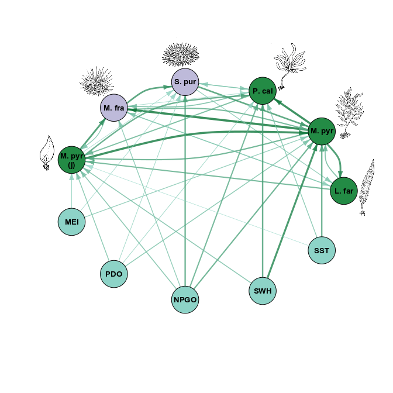

# Environmental Context Dependency in Species Interactions
This repository accompanies the manuscript "Environmental Context Dependency in Species Interactions".

A full description and step-by-step tutorial is provided in `edm_analysis.html`, with all of the underlying code provided in the RMarkdown file `edm_analysis.Rmd`. To download and run a fully reproducible version of the analysis, this repository can be forked or cloned. The file `edm_analysis_code_only.R` is simply an extraction of the code from `edm_analysis.Rmd`, but viewers are encouraged to use the `html` and `Rmd` to most easily follow the steps of the analysis.

Raw data and all associated data preparation scripts are in the `data` folder. The main analysis (`edm_analysis`) begins by calling scripts that perform these data processing steps.

Please contact the author with any questions.

